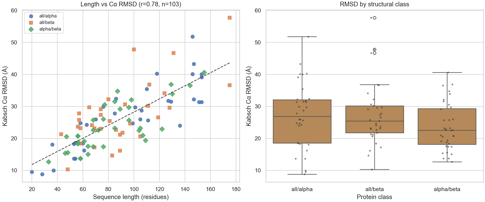
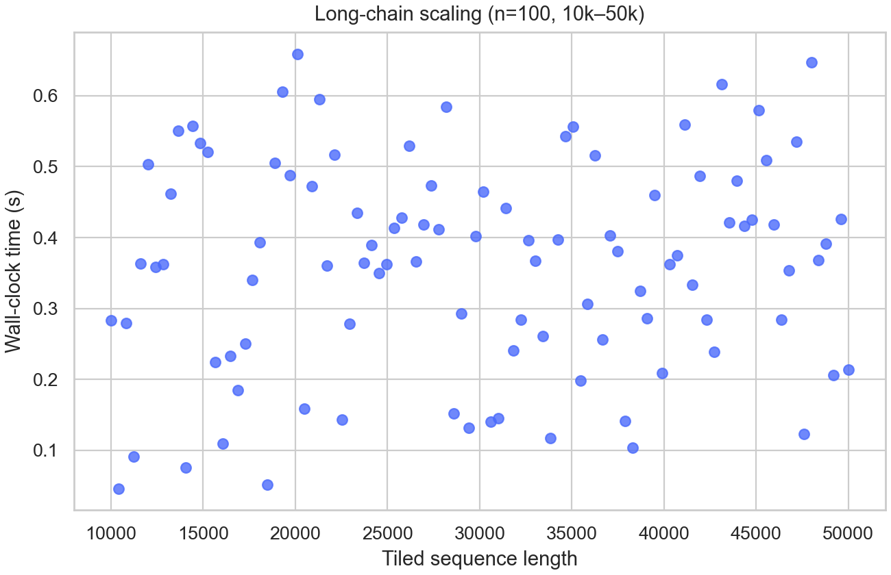
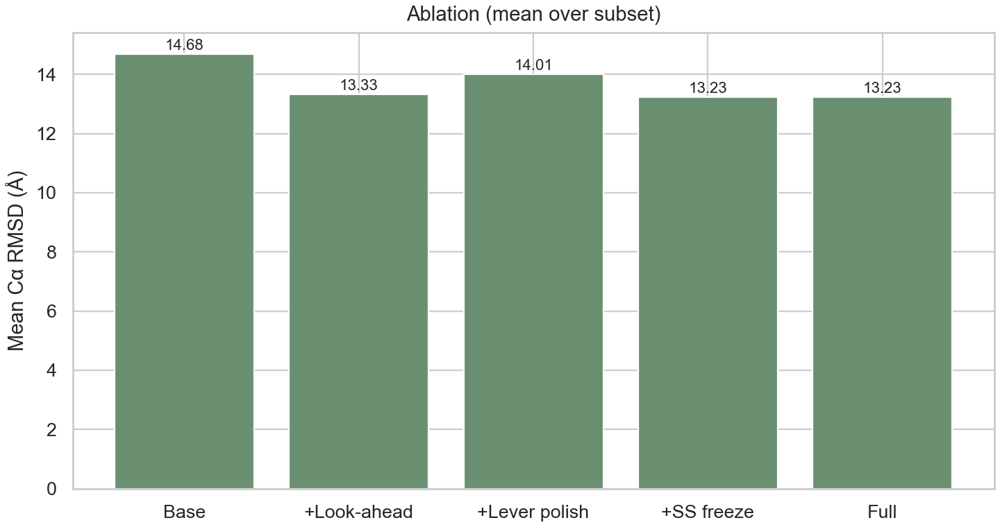

# PairFold

### Fast Local Backbone Generation

**PairFold** is a fast, near-linear **O(N)** local backbone generator that runs on consumer GPUs. It predicts residue-level backbone torsions (φ/ψ), assembles Cα traces (optional all-atom for short chains), and can serve **massive sequence queries up to 50,000 residues** at the angle level — designed for rapid structural prototyping and interactive visualization, not global fold competition.

<p align="center">
  
</p>

---

## Why PairFold?

| | PairFold | Full tertiary folders (e.g. AlphaFold / ESMFold) |
|---|---|---|
| **Goal** | Fast local geometry + viz | Near-experimental global folds |
| **Scaling** | Near-linear O(N) on consumer GPUs | Heavy MSA / Evoformer / large LM stacks |
| **Long queries** | Up to **50k** residues (angles / Cα-trace) | Typically much shorter practical limits |
| **Memory** | **Low** (commodity GPU) | **High** VRAM |
| **Typical Cα accuracy** | Domains100 mean **~26 Å** (interactive path); ablation full local stack **~13 Å** | Often **1–4 Å** global |

---

## Expanded Benchmarks

Results from the expanded evaluation suite (`benchmarks/benchmark_expanded.py`, `benchmark_ablation.py`). CSVs and plots live under [`benchmarks/results/`](benchmarks/results/).

### Domains100 — 103 diverse domains

Interactive consensus + SS path (contact hinge / look-ahead off for panel scale).

| Class | n | Mean Cα RMSD | Mean time |
|---|---:|---:|---:|
| all-α | 34 | 26.98 Å | 2.95 s |
| all-β | 33 | 27.28 Å | 2.28 s |
| α/β | 36 | 23.55 Å | 2.77 s |
| **All** | **103** | **25.88 Å** | **2.67 s** |

- Median RMSD: **24.73 Å**
- Length–RMSD Pearson correlation: **r = 0.78**
- CSV: [`benchmarks/results/benchmark_domains100.csv`](benchmarks/results/benchmark_domains100.csv)

### Ablation — 20 representative domains

| Configuration | Mean RMSD | Mean time |
|---|---:|---:|
| Base (consensus only) | 14.68 Å | 6.09 s |
| + Look-ahead | 13.33 Å | 9.68 s |
| + Lever polish | 14.01 Å | 11.93 s |
| + SS freezing | 13.23 Å | 15.29 s |
| **Full local stack** | **13.23 Å** | **15.29 s** |

### Method comparison

| Method | Mean time | Mean RMSD | Memory |
|---|---|---|---|
| **PairFold (Domains100)** | **2.67 s** | **25.9 Å** | Low |
| Rosetta ab initio* | 10²–10⁴ s | ~5–12 Å | High |
| ESMFold* | ~10–60 s | ~2–4 Å | High |

\*Rosetta / ESMFold: literature / typical ranges (not re-run here).

### Long100 — tiled 10k–50k sequences

| Metric | Value |
|---|---|
| Cases | **100** |
| Length range | **10,000 – 50,000** |
| Mean wall-clock | **0.36 s** |
| Mean per-tile Cα RMSD | **26.34 Å** |

CSV: [`benchmarks/results/benchmark_long100.csv`](benchmarks/results/benchmark_long100.csv)

<p align="center">
  
  &nbsp;
  
</p>

### Reproduce expanded benches

```bash
# Domains100 + Long100 + plots/tables
powershell -File benchmarks/run_paper_benches.ps1
# or stepwise:
python -u benchmarks/benchmark_expanded.py --domains-only
python -u benchmarks/benchmark_ablation.py
python -u benchmarks/benchmark_expanded.py --long-only --long-cases 100
python -u benchmarks/plot_expanded.py
python -u benchmarks/write_paper_tables.py
```

---

## Key Features

- **Calibrated confidence** — inference-time temperature sharpening with **T = 0.55**
- **Dynamic-programming segmentation** — overlapping 2–5 residue PDB-trained windows; fast tiling for very long chains
- **Secondary-structure freezing** — helix/strand blocks for **N ≤ 256**
- **Clash-aware look-ahead** — steric search and lever-effect correction (**N ≤ 256**, node-capped)
- **Contact steering (optional)** — ESM-2 / ContactPairNet anchors + early hinge fold on short domains
- **Stage-2/3 all-atom** — sidechain / atom export for short sequences (viewer + export)
- **UniProtKB import** — search by protein name, gene, Entry Name, or accession; browse natural variants vs mutagenesis and load wild-type or mutant sequences
- **Web + API** — FastAPI server and Vite/Three.js UI with interactive 3D (inline all-atom when available)

---

## Honest Disclaimer

> **PairFold is not a tertiary folding competitor to AlphaFold or ESMFold.**

It optimizes for **speed and local backbone geometry**. Domains100 interactive-path mean RMSD (**~26 Å**) and ablation full-stack (**~13 Å** on 20 short domains) remain **far from** AlphaFold-class **1–3 Å** accuracy. Use it for prototyping, teaching, and long-sequence visualization — not as a drop-in folding oracle.

| What it is good for | What it is not |
|---|---|
| Fast local φ/ψ / Cα prototypes | Atomic-accuracy global folds |
| Long-sequence angle-level scans (≤50k) | MSA-driven evolutionary modeling |
| Interactive 3D inspection in the browser | Drop-in AlphaFold / ESMFold replacement |

---

## Installation

### Requirements

- Python **3.8+**
- A CUDA GPU is recommended for training / faster inference (CPU works for short queries)
- Optional: Node.js 18+ for the web UI

### Install the package (editable)

```bash
git clone https://github.com/laravel840/PairFold.git
cd PairFold

python -m pip install -U pip
python -m pip install -e .
```

This installs the `pairfold` package and the **`pairfold-server`** console command.

For benchmarks / plotting extras:

```bash
python -m pip install -e ".[bench]"
# or
python -m pip install -r requirements.txt
```

---

## Usage

### 1. Start the inference API

```bash
pairfold-server
```

The server listens on **http://127.0.0.1:8000** (CORS enabled for the local UI).

```bash
python -m pairfold.server
```

### 2. Predict from the CLI

```bash
python -m pairfold.predict AGPVK
python -m pairfold.predict AGPVKLLTFGAA
```

### 3. Open the web UI

**Do not open `index.html` from disk** (`file://`) — browsers block the app scripts that way.

**One click:** double-click **`Web/Open PairFold.vbs`** (or `Web/PairFold.cmd`). It starts the server if needed and opens **http://127.0.0.1:8000/**.

Manual:

```bash
npm run build
python -m pairfold.server
```

For frontend hot-reload during UI work:

```bash
# terminal A
python -m pairfold.server --no-browser
# terminal B
npm run dev
```

Then open **http://127.0.0.1:5173/** (Vite proxies `/predict` → `:8000`).

---

## Project Layout

```text
PairFold/
├── Web/                   # One-click web launcher
│   ├── Open PairFold.vbs  # Double-click → start server + open browser
│   └── PairFold.cmd       # Same launcher (calls the .vbs)
├── pairfold/              # Core Python package (ML + inference)
├── benchmarks/            # Expanded benches, ablation, plots
│   ├── sets/domains_100.json
│   ├── results/           # Domains100 / Long100 / ablation CSVs
│   └── run_paper_benches.ps1
├── src/                   # Vite frontend source (Three.js viewer)
├── dist/                  # Built HTML app (npm run build)
├── examples/              # Sample sequences
├── requirements.txt
├── setup.py
├── package.json
└── README.md
```

---

## Training Pipeline (optional)

```bash
python -m pairfold.data.fetch_pdb
python -m pairfold.data.extract_fragments
python -m pairfold.data.extract_contacts
python -m pairfold.train
python -m pairfold.train_contact
pairfold-server
```

---

## Limits at a Glance

| Setting | Default | Role |
|---|---:|---|
| Max query length | 50,000 | Angle-level / Cα-trace queries |
| SS freeze + clash backtracking | ≤ 256 | Heavy steric / SS pipeline |
| Full DP segmentation | ≤ 2,048 | Above this → fast tile assemble |
| Contact head | ≤ 1,000 | Skipped on very long chains (RAM) |
| Stage-2/3 all-atom | ≤ 256 | Sidechains / atoms |

---

## License

MIT (unless otherwise noted in individual assets or checkpoints).

---

<p align="center">
  <b>PairFold</b> — fast local backbones on your GPU.<br/>
  <sub>Prototype locally. Inspect interactively. Don’t confuse local geometry with AlphaFold-level folds.</sub>
</p>
